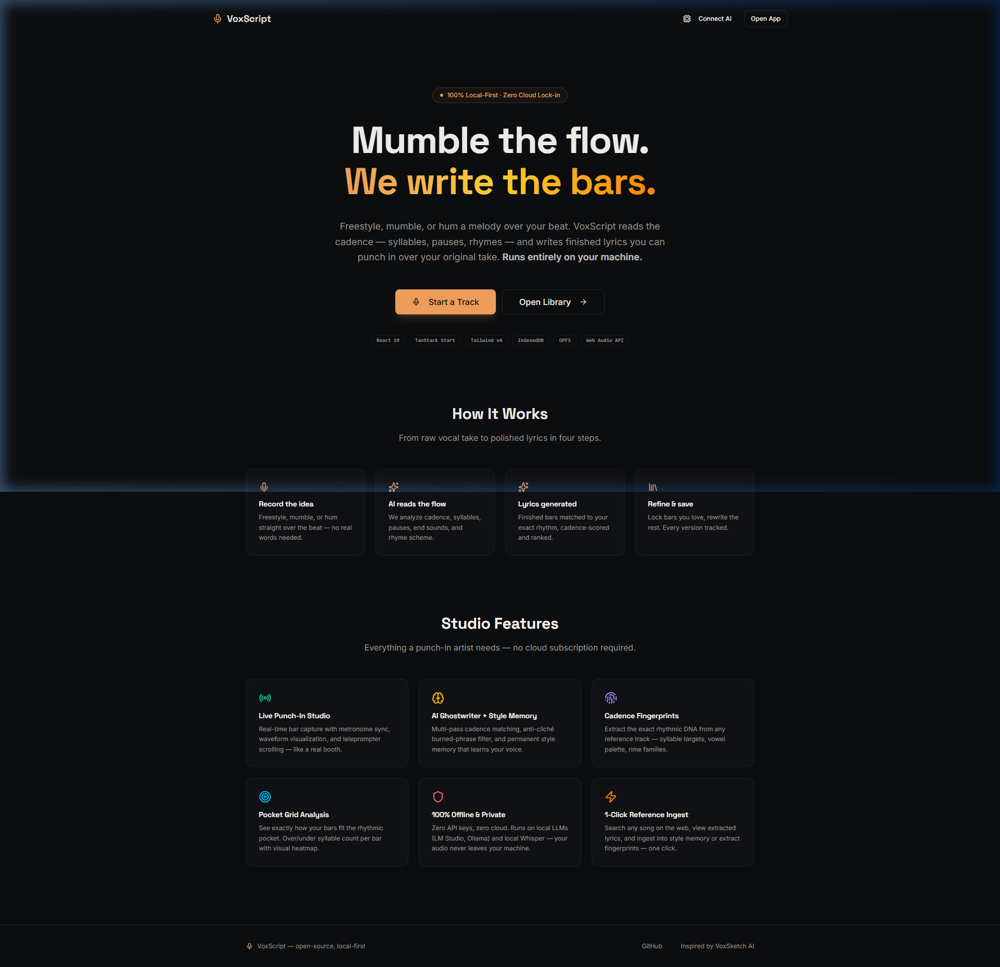
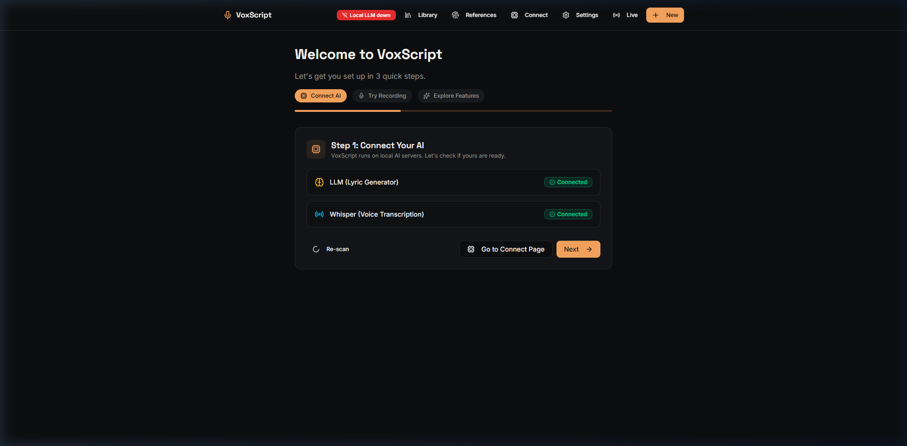
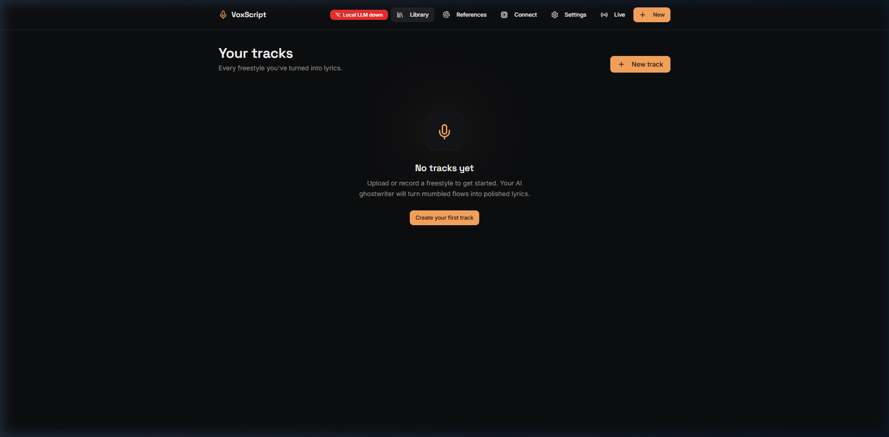
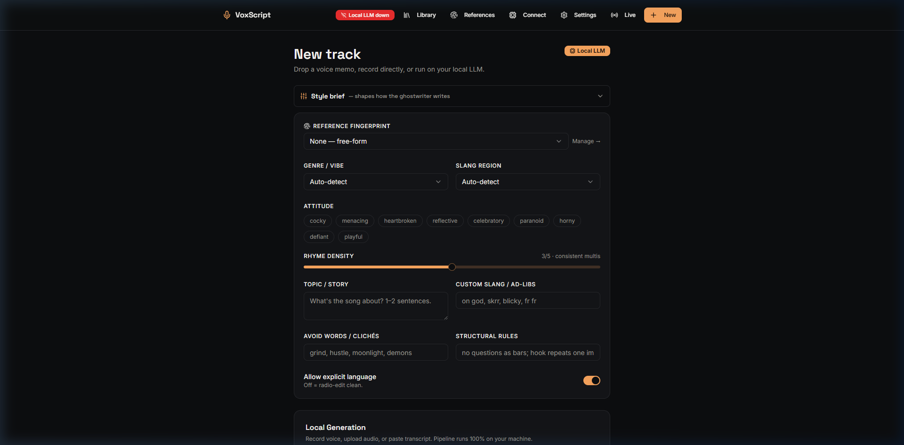
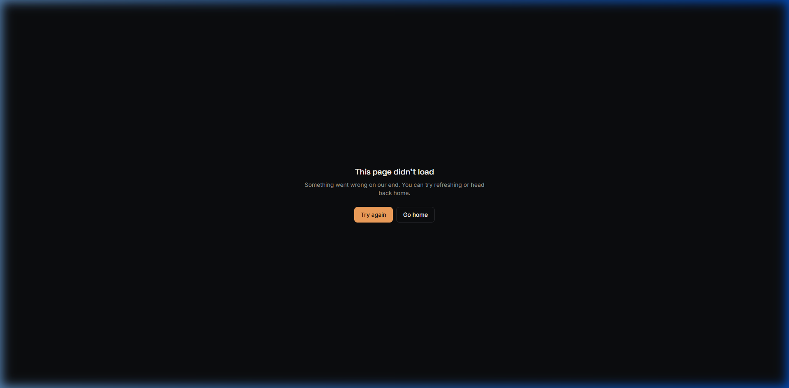
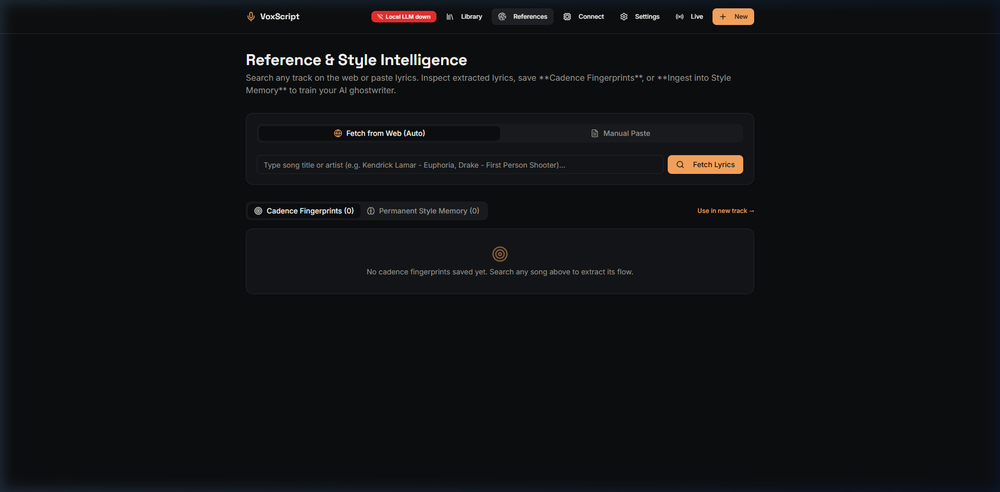

# Vocal Muse (VoxScript)

<p align="center">
  
  
  
  
  
  
</p>

An open-source, local-first studio workspace for vocalists, songwriters, and producers. **Vocal Muse** turns mumble freestyles into Drake/Kendrick-tier polished lyrics, maps audio cadences in real-time, and builds a personalized style memory—all running **100% offline** on your local machine with zero cloud lock-in.

---

## 💡 Inspiration: VoxSketch AI

**Vocal Muse** is heavily inspired by **[VoxSketch AI](https://voxsketch.com/)**, pioneering the concept of turning raw vocal mumble recordings and spontaneous freestyles into structured, cadence-matched song lyrics.

While cloud-based tools rely on remote APIs and subscription credits, **Vocal Muse** brings this workflow to the open-source community as a **100% local-first application**. Your audio recordings, vocal takes, and style memory never leave your device.

---

## ✨ Features

- 🎙️ **Live Punch-In Studio**: Real-time voice capture with latency-compensated bar slicing, Web Audio oscilloscope waveform, and metronome pulse ring.
- 🧠 **Ghostwriter & Style Memory**: Multi-pass cadence matching, anti-cliché burned-phrase filter, and semantic embedding recall.
- 🔒 **100% Offline & Private**: Zero API keys or cloud subscriptions required. Runs on local LLMs (**LM Studio**, **Ollama**) and local STT (**faster-whisper-server**).
- 💾 **Local-First Storage**: Audio takes save to **OPFS** (Origin Private File System); tracks and style memories save to **IndexedDB**. Includes 1-click JSON bundle import/export.
- 🎵 **Rhymes & Language Intelligence**: Offline CMUdict phonetic dictionary, keyless Datamuse API, and deep-linking into [RhymeWave](https://www.rhymewave.com/) for phonetic exploration.
- ⌨️ **Keyboard Shortcuts & Sound FX**: Integrated shortcut system (`?` overlay) and synthesized Web Audio sound FX cues.
- 🕸️ **Knowledge Graph Enabled**: Complete codebase AST indexed with [Graphify](https://github.com/sponsors/safishamsi) for interactive architectural exploration.

---

## 📸 Interface Showcase & Visual Tour

Explore the core studios and modules of **Vocal Muse**:

### 1. Landing Page (`/`)
*Gradient-backed hero section highlighting 100% local-first features and quickstart options.*



### 2. Onboarding Wizard (`/onboarding`)
*3-step setup flow for auto-scanning local LLM/Whisper servers, trying demo recordings, and feature discovery.*



### 3. Track Library (`/library`)
*The central dashboard featuring real-time search, status filter dropdowns, and sort options.*



### 4. New Track Studio (`/new`)
*Create new songs from mumble transcripts, live mic recordings, or uploaded audio files with vocal guidance tips.*



### 5. Live Punch-In Studio (`/live`)
*Real-time vocal capture featuring live oscilloscope waveform visualizer, metronome ring, and bar pocket analysis.*



### 6. Reference & Style Intelligence (`/references`)
*1-click web lyric scraper to extract cadence blueprints (Cadence Fingerprints) and train your AI ghostwriter.*



---

## 🚀 Quickstart

### Option A: Windows 1-Click Launcher (Recommended)
Double-click `start-local.bat` in the project root. It automatically:
1. Runs pre-flight diagnostic checks (Node.js version, missing dependencies).
2. Auto-starts `faster-whisper-server` (voice transcription) on port `9000` if installed.
3. Opens **[http://localhost:8080](http://localhost:8080)** in your web browser.
4. Starts the local development server.

### Option B: Command Line (Cross-Platform)

```bash
# 1. Install dependencies (Bun or NPM)
bun install   # or: npm install

# 2. Start development server
bun dev       # or: npm run dev
```

Open **`http://localhost:8080`** in your browser.

---

## 🤖 Local AI Setup (Optional)

### 1. Local LLM (LM Studio / Ollama)
For offline AI lyric generation and ghostwriter assistance:
- **LM Studio**: Open LM Studio $\rightarrow$ Load a model (e.g., `Qwen2.5-7B` or `Llama-3.2`) $\rightarrow$ Go to **Local Server** tab ($\langle/\rangle$) $\rightarrow$ Click **Start Server** (Port `1234`). Enable **CORS** in settings.
- **Ollama**: Run `ollama pull llama3.1:8b` and start with `OLLAMA_ORIGINS='*' ollama serve`.

### 2. Live Voice Transcription (faster-whisper)
For real-time voice-to-text recording:
```bash
pip install faster-whisper-server
faster-whisper-server --model Systran/faster-whisper-base.en --port 9000
```

---

## 🛠️ Architecture & Tech Stack

```
Vocal Muse Architecture
├── src/routes/             # TanStack Start file-based routing (_app/live, _app/onboarding, etc.)
├── src/lib/local-pipeline  # Multi-pass cadence matching & ghostwriter refinement pipeline
├── src/lib/local-store     # IndexedDB (tracks, bars) & OPFS (audio takes) local persistence
├── src/lib/style-memory    # Few-shot vector recall & anti-cliché phrase burner
├── src/lib/rhymes          # Phonetic lookup engine & RhymeWave deep-link integration
└── graphify-out/          # Persistent AST Knowledge Graph (graph.html & GRAPH_REPORT.md)
```

---

## 🤝 Contributing

We welcome contributions from developers, musicians, sound engineers, and AI enthusiasts!

### How to Contribute:
1. **Fork & Clone**:
   ```bash
   git clone https://github.com/ChiragNSundar/Vocal-Muse.git
   cd Vocal-Muse
   ```
2. **Install & Run Tests**:
   ```bash
   bun install
   bun test       # Vitest unit test suite (40/40 tests)
   ```
3. **Submit a Pull Request**:
   - Create a feature branch (`git checkout -b feature/awesome-feature`).
   - Ensure all tests pass (`bun test` or `npm test`).
   - Open a PR with a clear description of your changes.

---

## 📄 License & Acknowledgments

- **License**: Released under the **MIT License**.
- **Special Thanks**: Inspired by **[VoxSketch AI](https://voxsketch.com/)** for pioneering AI vocal mumble transcription.
- **Phonetics**: Powered by CMUdict, Datamuse, and RhymeWave.
